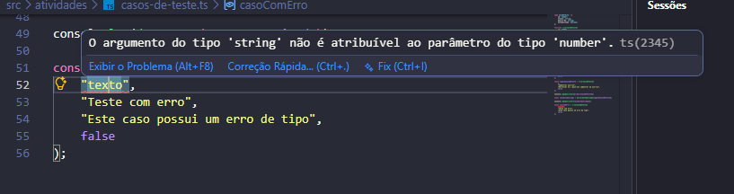

# Atividade - Casos de Teste

## O que foi feito

Foi criado o arquivo `src/atividades/casos-de-teste.ts`.

Nele foi criado o tipo `CasoDeTeste` com as propriedades:
- `id`: number
- `titulo`: string
- `descrição`: string
- `automatizado`: boolean

Também foram criadas as funções:
- `criarCasoDeTeste`: cria e retorna um novo caso de teste.
- `descrever`: retorna uma string com a descrição formatada do caso de teste.
- `marcarAutomatizado`: altera a propriedade `automatizado` para `true`.

Foram criados casos de teste e constantes para utilizar as funções.

## Como rodar

Para verificar os erros de tipo no TypeScript sem gerar arquivos de compilação:
```bash
npx tsc --noEmit

### Print do Erro
